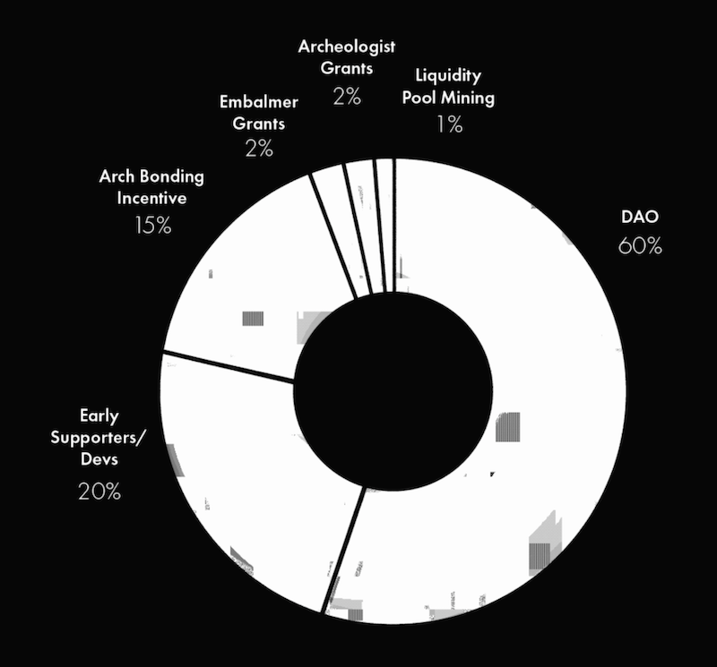
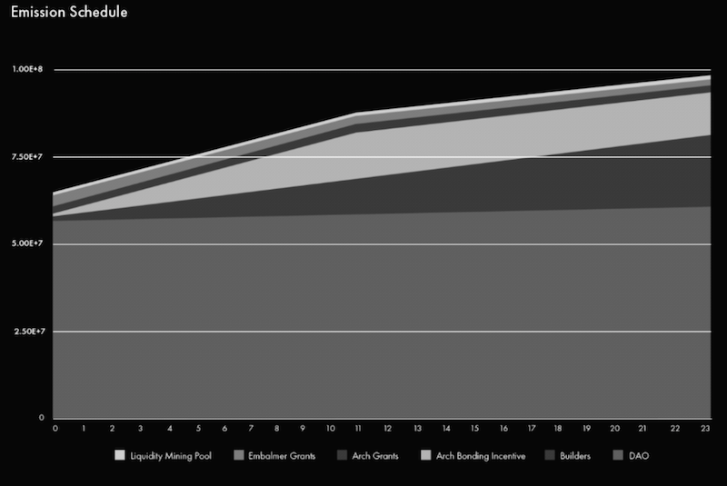

# Sarcophagus Token

Sarcophagus is a decentralized dead man's switch built on Ethereum and Arweave.

## Overview
This repository contains the smart contracts necessary for the creation, distribution, and vesting of SARCO, the token that powers Sarcophagus.

## Distribution
SARCO tokens will be distributed amongst the Sarcophagus DAO, the Builders of Sarcophagus, and to support the bond incentive, grant, and liquidity mining programs.

Distribution Breakdown:
| Entity               | Holdings     | Vesting in months |
| :------------------- | :----------: | ----------------: |
|  DAO                 | 60M          | 0                 |
|  Builders            | 20M          | 24                |
|  Bond Incentive      | 15M          | 12                |
|  Embalmer Grants     | 2M           | 0                 |
|  Archaelogist Grants | 2M           | 0                 |
|  Liquidity Mining    | 1M           | 12                |

## Vesting Schedule
The vesting schedule for the builders tokens is linear, per second, for two years, and applies equally to all builders. No VC or other exceptions. This contract can be found [here](https://github.com/sarcophagus-org/sarco-token/blob/master/contracts/TokenVesting.sol).

Both the bond incentive and liquidity mining allocations are vested over the course of one year as a virtue of the structure of their respective contracts, separate from the builder vesting contract. The liquidity mining contract can be found [here](https://github.com/sarcophagus-org/liquidity-mining/blob/master/contracts/LiquidityMining.sol).

## Community

We can also be found on [Telegram](https://t.me/sarcophagusio).

Made with :skull: and proudly decentralized.